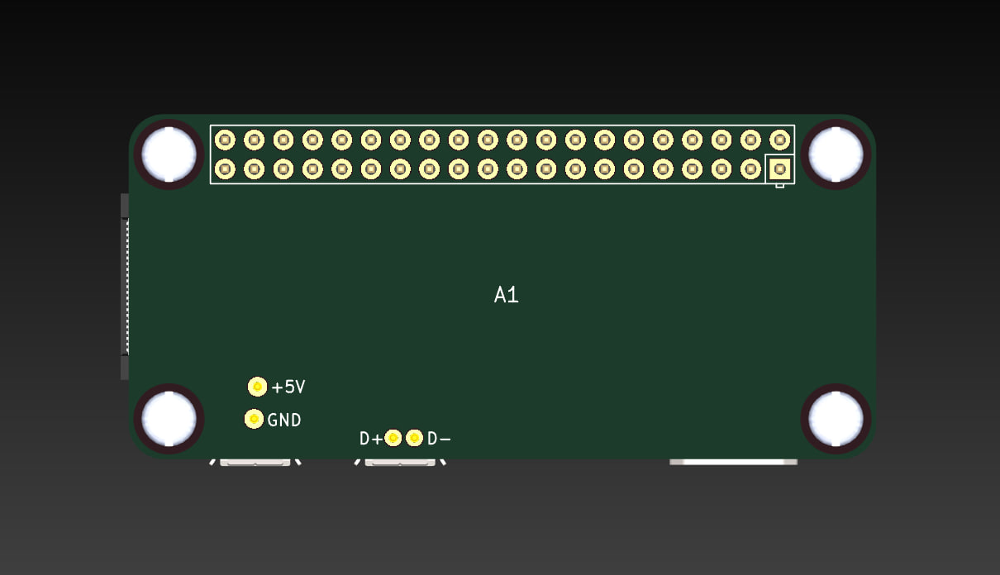
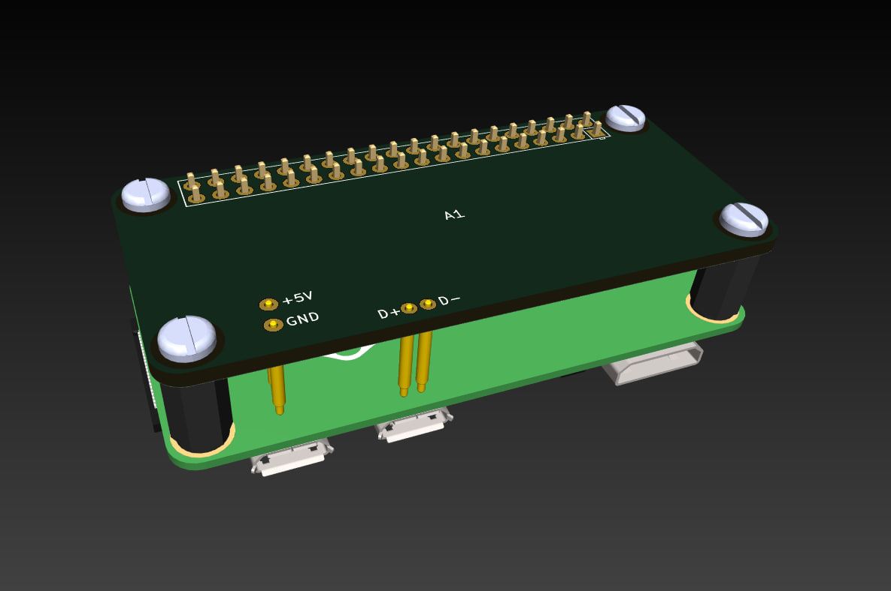

# PiZeroHat

KiCad component and example project for creating Raspberry Pi Zero Shields/Hats with USB and power lines directly (nor with extra cables), with a help of pogo pins (spring contacts).

You can use it to create Pi Zero-based devices with onboard USB peripherals and advanced power circuits. For example USB-hubs and Ethernet drivers or other USB peripherals.

PiZeroHat KiCad library includes schematic symbols with D+, D- USB lines and +5V_USB and GND lines to power Raspberry Pi Zero properly, and a footprint with 2x20 RPi connector, pogo-pin's points and 2.75mm fixture holes for M2.5 stand-offs.

I've used a 10mm stand-off because of the 2x20 connector height. If you find a shorter connector, you can shorten the standoffs and use shorter pogo pins.

The goal was to make a PiZeroHat for cases then you need USB lines onboard with a complete 2x20 Pi connector to use also I2C, SPI and Pi GPIOs on your Hat.

Pogo pins will work with:
- Raspberry Pi Zero v1.3
- Raspberry Pi Zero W (see note below)
- Raspberry Pi Zero 2W (see note below)

> [!NOTE]
> PiZeroHat will work with Zero W and Zero 2W only if the ferrite ring is installed on D+ and D- pogo pins because of high WiFi radiation which affects on USB data transmission.

## BOM:
- 4pcs CPG-01-TH-B - pogo pins for USB and power connections from CUI
- 4pcs 970100155 - 10mm M2.5 F-F Nylon stand-off from Wurth
- 8pcs 29331 - M2.5x6mm nylon screws from Keystone
- 1pc 742701712 - ф9*/ф5mm*/H8mm ferrite ring - install on D+/D- pogo pins
- 1pcs 2822 - 2x20-pin Strip Dual Male Header from Adafruit
- 1pcs 2243 -  2x20 Short Female Header from Adafruit

You can use alternatives with the same dimensions from any manufacturer.